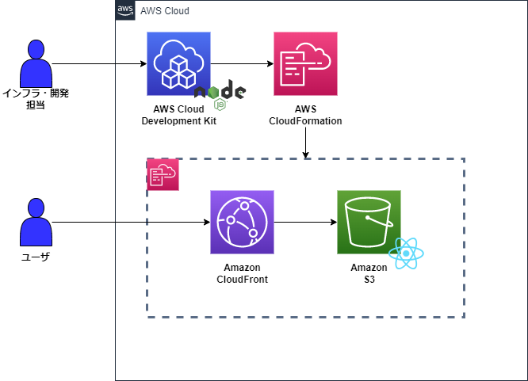
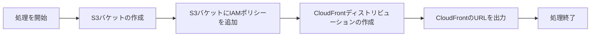

# CDK CloudFront & S3 Sample
このリポジトリは、CloudFront経由でS3を公開するサンプルコードです。

## 環境

**使用技術とバージョン**

| 技術 | バージョン |
| --- | --- |
| Node.js | v18.12.1 |
| CDK | 2.84.0 |
| React | 18.2.0 |
| Express | 4.18.2 |

# インフラ構成図

# 処理フロー

